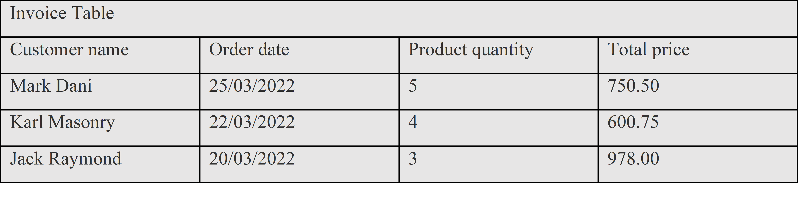
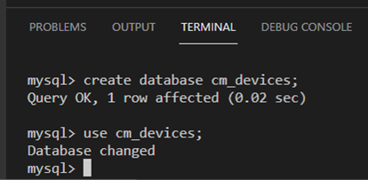
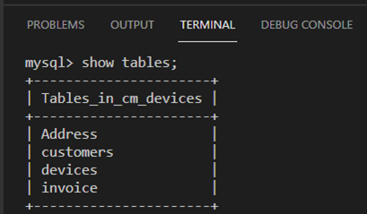
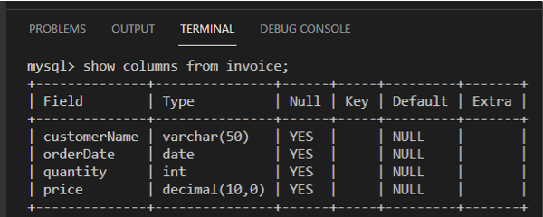

# C1M2L1 – (Exercise: Choosing the right type for a column)

<br><br>
 ### **Tips: Before you Begin**
> - To view this file in Preview mode, right click on this LabInstructions.md file and `Open Preview`

<br>
<br>

The goal of this exercise is for you to learn how to choose suitable data types for a variety of columns to store data as string, integer, date and decimal values. The objective is for you to practice choosing suitable data types for different kinds of columns in a table.  

#### Scenario
Mr. Carl Merkel owns a small business named CM Mobiles that sells mobile devices in Harrow town near London. He wants to create a database to store key information about customers’ orders to generate invoices for his customers including customer name, order date, quantity and total price as shown in the invoice table below. 




 
Note: You are required to complete this exercise inside MySQL on the Coursera platform. If you have any doubts about how to access it, please view the readme file available in the course webpage. 

#### Instructions
Please attempt the tasks below before you continue so you can check and compare your answers with the solution.

You are required to write a ‘CREATE TABLE” SQL statement with relevant attributes and data types.

1.	Identify the columns and define the data type for each column of the table.
2.	Write a complete SQL statement to create the invoices table inside the cm_devices database.


**Identifying the table columns and data types**

According to the given scenario you are required to design the invoice table which consists of different types of columns that will store different types of data. As a database developer, you should choose a data type that meets the expected type of data that will be stored in the column based on the following guidelines.

* If the column is expected to store numeric data, then you need to choose a numeric data type such as INT or DECIMAL. 
* If the column is expected to store alphabetic or alphanumeric data, then you need to choose a string data type such as CHAR or VARCHAR. 
* If the column is expected to store date data, then you need to choose the date data type. 

Now, let’s take the invoice table columns one by one and apply the guidelines.

1.	Customer name: the string data type is suitable for the customer's name as you expect it to store data with alphabetic characters. In this case you can use VARCHAR as you expect to have customer names with different lengths of characters.
2.	Order date: the date data type is suitable for the order date as you expect it to store data with dates.
3.	Product quantity: the integer data type is suitable for the order quantity as you expect it to store whole numbers of data.
4.	Total price: the decimal data type is suitable for the product price as you expect it to store numeric data with fractions.


**Building the invoice table in SQL**

**Note: You need to have a database to create the table inside it. If you don’t have one yet, see below how to create the CM Mobiles database.**

1-Type the following SQL statement inside the SQL terminal editor on the Coursera platform.

```SQL
CREATE DATABASE cm_devices; 

```


2-Click enter to execute the create database statement. 

3-Make sure you select the database to use it by typing the following SQL statement and click enter. 

```SQL
Use cm_devices; 

```



 
**Create the SQL statement**

1-Write an SQL statement  that contains the CREATE TABLE command followed by the name of the table, which is “invoice” in this case.  

2-Open parenthesis to define the tables columns including customer ID, order date, quantity and total price.  

3-Assign each column a suitable datatype as described earlier. 

4-Add a closing parenthesis and a semi-colon to the end of the SQL statement as follows:

```SQL
CREATE TABLE invoice(customerID VARCHAR(50), orderDate DATE, quantity INT, price DECIMAL);  

```

5-Press enter to execute the query.

If you have followed all the steps correctly you should now be able to see the invoice table created inside the cm_devices database by typing:

```SQL
Show tables;

```

6-Press enter to execute the query. The output result is in the image below that displays the list of tables that exist in the ‘cm devices’ database.  



7-If you want to check the structure of the invoice table, type the following SQL statement and click enter.

```SQL
Show columns from invoice; 

```
 
This will display the invoice table structure.



In this exercise, you have learned how to choose suitable data types for a variety of columns.
Here is an additional task for you to test your skills. 


**Additional task (optional)**

Mr. Carl Merkel  needs a new table to store the contact details of each customer, including their account number, phone number and email address. 

You must choose a relevant data type for each of these columns.  


**Solution**
Account number: INTEGER
Phone number: INTEGER
Email: VARCHAR  


