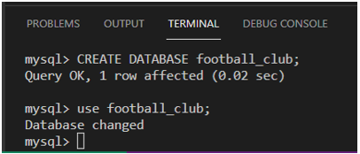
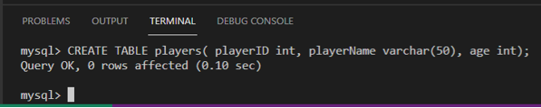
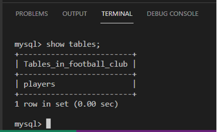

# C1M2L2 – (Exercise: Practicing table creation)

<br><br>
 ### **Tips: Before you Begin**
> - To view this file in Preview mode, right click on this LabInstructions.md file and `Open Preview`

<br>
<br>

In this exercise, you will learn how to practice a table creation in a database from scratch. The objective of the exercise is to build a table in a database for the given scenario. You’ll then review the solution to check and compare your design and implementation of the table.   

#### Scenario
Mr. Erik Anderson has created a new football club for kids under 16 years old. He needs to create a table to store the players’ basic personal data including identity number, name and age.  

**Note: You are required to complete this exercise inside MySQL on the Coursera platform. If you have any doubts about how to access it, please view the readme file available in the course webpage.**

#### Instructions
Please attempt the tasks below before you continue so you can check and compare your answers with the solution.

Task 1: Create a database called football club. 
Task 2: Create a table to store the data as follows:
* Identify a suitable table name to store the players’ personal data. 
* Identify the table attributes and data types. 
* Write an SQL statement to create the table. 


**Task 1: Create your database**

1-You cannot build tables if there is no relevant database available to create tables inside it. Therefore, let’s create a new database for Mr. Anderson’s data if you have not already created a database; you need to do so by typing the following SQL statement inside the SQL code editor in Coursera platform as displayed below. 
2-Click enter to execute the create football club database. 
3-Make sure you select the database to use it by typing the following SQL statement. Click enter.


```SQL
Use football_club; 

```




**Task 2: Create your table**

1-Write an SQL statement that contains the CREATE TABLE command followed by the name of the table. Players is a suitable name in this case. 
2-Open parenthesis to define the tables columns:  
* Player ID
* Player name 
* Player age
3-Assign each column a suitable data type. In this case, you can choose the following suitable data types:
* player ID: INT
* player name: VARCHAR(50)
* player age: INT 
4-Once all the required columns have been defined, add a closing parenthesis and a semi-colon at the end of the SQL statement as follows: 


```SQL
CREATE TABLE players( playerID int, playerName varchar(50), age int);

```

5-Press enter to execute the SQL statement. 

The image below displays the output after executing the CREATE TABLE ‘players’ statement.  




If you have followed all the steps correctly you should now be able to see the players table created inside the football_club database by typing the following show tables statement:


```SQL
Show tables;

```

6-Click enter and you should be able to get the players table inside the football club database as in the image below.  You may see more tables as well if you have already created other tables in this database.  



In this exercise, you have practiced how to create a basic table inside a database. Here is an additional task for you to complete. 


**Additional task (optional)**

Mr. Anderson  wants to create another table to record information about the games the team will play, including the gameID, the score of each game and the dates they’re played on.      Your task is to create this table for the football club.  


**Solution**
Write the following SQL statement and press enter to execute it:

```SQL
CREATE TABLE games(gameID INT, gameDate DATE, score INT);   

```


