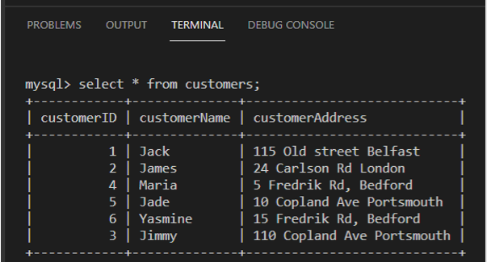
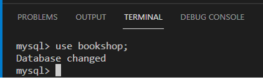
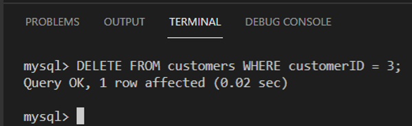
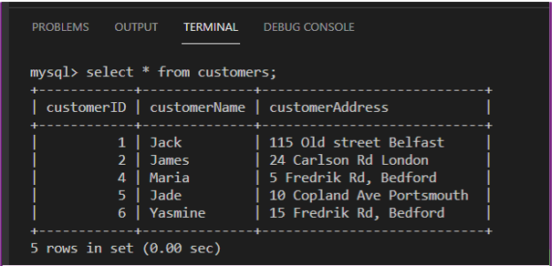

# C1M2L3 – (Exercise: Record deletion)

<br><br>
 ### **Tips: Before you Begin**
> - To view this file in Preview mode, right click on this LabInstructions.md file and `Open Preview`

<br>
<br>

The goal of this exercise is to teach you how to delete records. You will have the opportunity to practice deleting a record from a table in a database.  

**Note: You are required to complete this exercise inside MySQL on the Coursera platform. If you have any doubts about how to access it, please view the readme file available in the course webpage.**

#### Scenario
Mr. John Ericson owns a small bookshop. His bookshop database includes a “Customers” table that contains the bookshop’s customers’ details. The image below displays all records of data stored in the customers’ table.



Mr. Ericson wants to remove the customer record of Jimmy with ID number 3.
The steps below will guide you through the process for deleting Jimmy’s record from the bookshop database. 


#### Instructions
Please attempt the tasks below before you continue so you can check and compare your answers with the solution.

You are expected to have the bookshop database and the customers table created in a previous exercise. 
You need to populate the customers table with relevant data to complete this exercise.
However, before you copy and paste this code, make sure you empty the table to avoid duplication of records. Type:

```SQL
TRUNCATE TABLE customers;

```

Copy and paste the following SQL statement into the SQL terminal section. 

```SQL
INSERT INTO `customers` (`customerID`, `customerName`, `customerAddress`) VALUES
(1, 'Jack', '115 Old street Belfast'),
(2, 'James', '24 Carlson Rd London'),
(4, 'Maria', '5 Fredrik Rd, Bedford'),
(5, 'Jade', '10 Copland Ave Portsmouth '),
(6, 'Yasmine', '15 Fredrik Rd, Bedford'),
(3, 'Jimmy', '110 Copland Ave Portsmouth');     

```

Task 2: Write an SQL statement to delete Jimmy’s record from the Customers table. 

**Delete customer**

1.1 Select the database by typing the following SQL statement. 

```SQL
Use bookshop;
```

1.2 Click enter.



2-Write the SQL statement. 

2.1 Write the “DELETE” command, followed by the FROM keyword to identify the source table containing the records. In this case, the table name is called “customers” table.

2.2 Write the WHERE clause followed by the condition to specify the record you want to delete. The condition should be when customerID equals to 3. The full syntax is as follows: 


```SQL
DELETE FROM customers WHERE customerID = 3;

```

2.3 Execute the query. Click the enter button on the keyboard. The SQL statement is executed and Jimmy’s record is deleted from the bookshop database.



You can type the following select statement to view the content of the customers table after deleting the record:

```SQL
SELECT * FROM customers;

```

This displays all data that exists the customer table.



Notice that the customer record with ID 3 has been removed from the bookshop database. 

In this exercise, you have practiced how to delete a record of data from the database using SQL DELETE command. 


**Additional task (optional)**

Mr. Ericson  wants to delete the record of the customer Yasmine. Your task now is to remove this customer’s details from the customer table.  


**Solution**
Write the following SQL statement in the SQL terminal editor, then click enter button to execute it.

```SQL
DELETE FROM customers WHERE customerID = 5;

```


