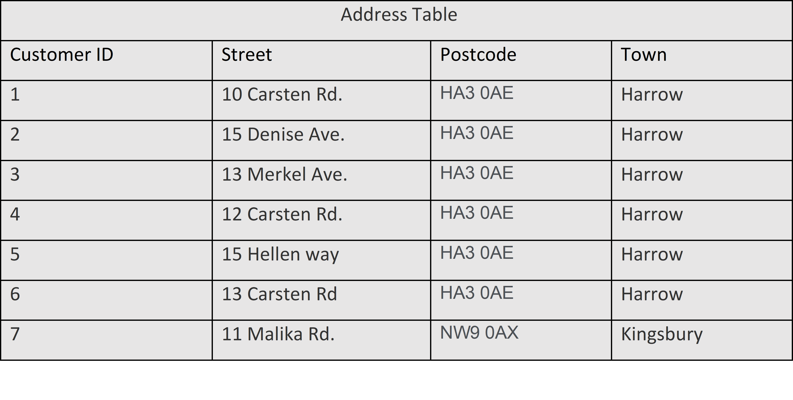
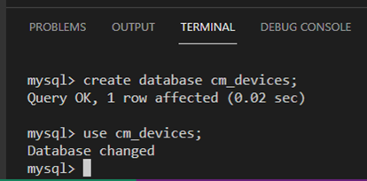
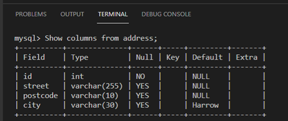

# C1M2L1 – (Exercise: Working with default values)

<br><br>
 ### **Tips: Before you Begin**
> - To view this file in Preview mode, right click on this LabInstructions.md file and `Open Preview`

<br>
<br>

The goal of this exercise is for you to learn how to work with default values in a database. The objective is to allow you to practice working with default values using the default constraint in SQL. 

#### Scenario
Mr. Carl Merkel owns a small business named CM Mobiles that sells mobile devices in Harrow, London. He wants to create a database to store key information about customers’ addresses including customer ID, street, postcode and town name. The list of addresses for current customers of CM Mobiles is provided in the following address table. 




 
Note: You are required to complete this exercise inside MySQL on the Coursera platform. If you have any doubts about how to access it, please view the readme file available in the course webpage.

#### Instructions
Create an SQL statement with relevant attributes and constraints as follows:

1.Identify the column that requires default values. 

2.Write a complete SQL statement to create the address table with relevant constraints. 

Please attempt the tasks below before you continue so you can check and compare your answers with the solution.

**Creating the table**

Identify the column with default values.

Notice that the address table shows that most customers live in the Harrow area, which means CM Mobiles customers are mainly from this town. 

In this case, you can define a default value for the town column as “Harrow” when you create the address table. This would relieve Mr. Karl from having to enter “Harrow” repeatedly into the town field for each new customer record as it will be filled automatically with the default value “Harrow” if no other value is entered into the table. 

**Note: You need to have a database to create the table inside it. If you don’t have one yet, see below how to create the CM Mobiles database.**

1.Type the following SQL statement inside the SQL terminal editor on the Coursera platform.

```SQL
CREATE DATABASE cm_devices; 

```


2.Click enter to execute the create database statement. 

3.Make sure you select the database to use it by typing the following SQL statement and click enter. 

```SQL
Use cm_devices; 

```



 
4.Create a table

4.1 Write the SQL CREATE TABLE command followed by the name of the table, “address” in this case. 

4.2 Open parenthesis to define the table’s columns including customer ID, street, postcode and town. Each column must be assigned a suitable data type as you learned in earlier videos and exercises. 

4.3 Use the SQL “DEFAULT” keyword to declare the pre-set default value. 

4.4 Once all required columns have been defined, add a closing parenthesis and a semi-colon at the end of the SQL statement as follows:
create table address(id int not null, street varchar(255), postcode varchar(10), town varchar(30) default "Harrow");
The DEFAULT keyword used in this statement is followed by the default value “Harrow” for the town name column in the Address table. In this case, if Mr. Carl Merkel wants to insert data into this table there is no need to type “Harrow” for any customer who lives in this town as it will be automatically inserted.

5.Execute the query by pressing enter.

6.If you want to check the structure of the address table, type the following SQL statement and click enter:

```SQL
Show columns from address; 

```

This will give you all the address table columns with data types and the default constraint “Harrow”. 



 

In this exercise, you have learned how to use the default constraint to enforce a specific default value which is very useful to use for columns expecting to hold the same data.
Here is an additional task for you to test your skills. 

Additional task (optional)
Mr. Carl Merkel notices that most customers have the same postcode, namely “HA97DE”. 
You are required to write the SQL statement again to declare both the postcode and the town name with default values. 

Remember to drop the address table before creating a new one. 

To drop the table, simply type: 
```SQL
DROP TABLE Address;. 

```

**Solution**

```SQL
CREATE TABLE Address (id int NOT NULL,  street VARCHAR(255), postcode VARCHAR(10) DEFAULT "HA97DE", town VARCHAR(30) DEFAULT "Harrow");

```


