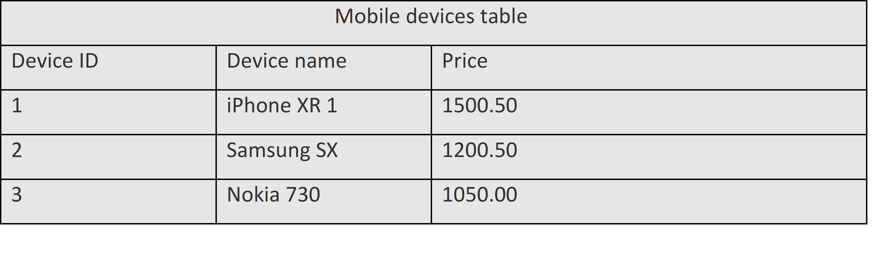
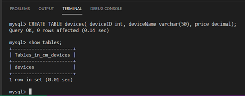
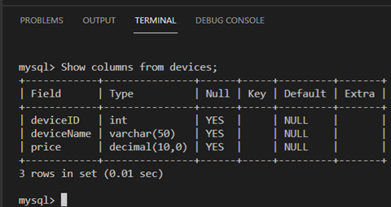
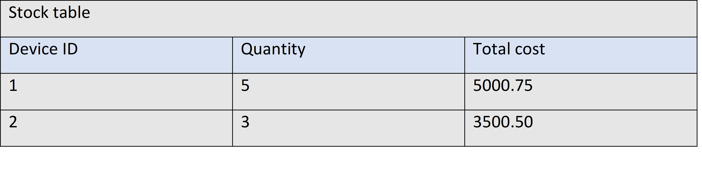

## C1M2L1 – (Exercise: Working with numbers)

<br><br>
 ### **Tips: Before you Begin**
> - To view this file in Preview mode, right click on this LabInstructions.md file and `Open Preview`

<br>
<br>

The goal of this exercise is for you to learn how to work with numerical values in a database. The objective of the exercise is that you will be able to demonstrate how to work with numerical data types in SQL. In this exercise you will learn about two main variations of numeric data types. 
Scenario
Mr. Carl Merkel owns a small business named CM Mobiles that sells mobile devices. He wants to create a database to store key information about mobile devices. This information includes: 
* the device ID or number, 
* the devices name,
* and the price of the device.

This information is displayed in the following table:


 
Note: You are required to complete this exercise inside MySQL on the Coursera platform. If you have any doubts about how to access it, please view the readme file available in the course webpage.

# Instructions
Please attempt the tasks below before you continue so you can check and compare your answers with the solution.

### Task 1: Create a database called cm_devices
<br>
1.Type the following SQL statement inside the SQL terminal editor in Coursera platform.
CREATE DATABASE cm_devices; 
<br>

2.Click enter to execute the create database statement. 
<br>
3.Make sure you select the database you want to create the table inside of by typing the following SQL statement: 
USE cm_devices; 
<br>
4.The SQL ‘USE’ keyword is used to select a database in MySQL followed by the name of the database. Click enter to execute the query. The output will be “Database changed”, as demonstrated in the following screenshot: 
<br>


### Task 2: Create a SQL statement with relevant attributes and data types 
<br>

1.Identify a suitable name for the table in which you want to store the data about mobile devices. In this case you can call the table “devices”. 
<br>
2.	Identify the data type for each column within the table. 
Based on CM Mobiles’ requirements, the mobile devices table must contain three columns as follows: 
* A column called “Device ID” which must store whole numbers. In this case you should use INT as the data type.
* A second column called “Device name” which is expected to store data as a string-like alphanumeric value. For example, iPhone XR 1.
* And a third column called “Price”. This final column is expected to store numeric data with possible fractional values. In this case you should use DECIMAL data type. With the decimal data type, there is no issue with storing a whole number because the fractional part is separated by a decimal point with 00 on the right side of the number. This is indicated in the third row of the mobile devices table, where the price is 1050.00 (which is equivalent to 1050).
<br>

3.Write a complete SQL statement to create the mobile devices table inside the cm_devices database.
<br>

3.1	Write the SQL statement that contains the CREATE TABLE command followed by the name of the table which is “devices” in this case.
<br>
3.2	Open parenthesis to define the table columns including device ID, device name and device number.
<br>
3.4	Define a suitable datatype for each column as follows:
* The column device ID with integer datatype.
* The price column with decimal datatype.
* The device name with VARCHAR. 
<br>

3.5 Add a closing parenthesis and a semi-colon at the end of the SQL statement. The complete statement should replicate the following syntax:

```SQL
CREATE TABLE devices( deviceID int, deviceName varchar(50), price decimal);
```

<br>
3.6	Execute the query by clicking enter. 
If you have followed all the steps correctly, you should now be able to access the devices table that was created inside the cm_mobiles database by typing:
show tables; 
3.7	Click enter. 




 
To check the structure of the devices table, type the following SQL statement and click enter.
Show columns from devices; 
This displays all the devices table’s columns and data types.


 
In this exercise, you have practiced how to define numeric datatypes in database. Here is an additional task for you to test your skills. 

Additional task (optional)
Mr. Merkel wants to create another basic table in the database to store data about the stock of the devices including device ID, quantity and total cost of the quantity as shown below.


 
Based on the table above complete the following:
1.	Identify an appropriate table name to create , given the information provided. 
2.	Identify columns that should be available in this table, and define them with the appropriate  data types. 
3.	Write the full SQL statement that creates the table and columns.

Solution
<br>
1. table name: stock
<br>
2. Device id INT
   Quantity INT
   Total cost Decimal 
<br>
3. SQL Code
 ```SQL

CREATE TABLE stock(deviceID int, quantity int, totalCost decimal);
```


