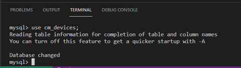
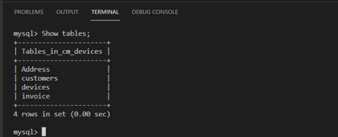
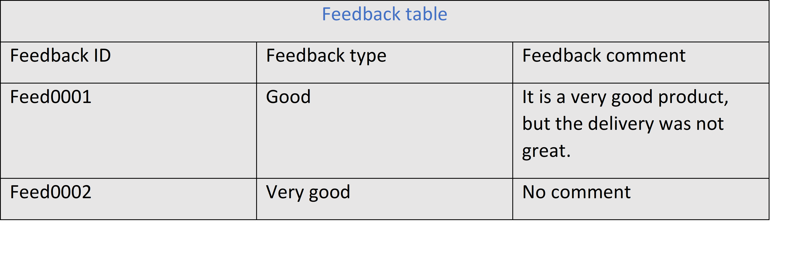

## C1M2L1 – (Exercise: Working with strings)

<br><br>
 ### **Tips: Before you Begin**
> - To view this file in Preview mode, right click on this LabInstructions.md file and `Open Preview`

<br>
<br>

The goal of this exercise is for you to learn how to work with string values in a database. The objective is to allow you to practice working with string data types in SQL. This exercise focuses on the two most used string datatypes in SQL: CHAR and VARCHAR.

#### Scenario
Mr. Carl Merkel owns a small business named CM Mobiles that sells mobile devices. He wants to create a new table to store key information about customers including the customer’s username, the customer’s full name and the customer’s email address as shown in the following table of data.
<br><br>


Note: You are required to complete this exercise inside MySQL on the Coursera platform. If you have any doubts about how to access it, please view the readme file available in the course webpage.

#### Instructions
Please attempt the tasks below before you continue so you can check and compare your answers with the solution.
<br>
Create an SQL statement with relevant attributes and data types as follows:
<br>

1.Identify a suitable name for the table in which you want to store data about mobile devices.
<br>

2.Identify the data type for each column of the table.
<br>

3.Write a complete SQL statement to create the table inside the cm_devices database.
<br>

##### Creating the table
1.When you create a table in a database, you need to identify a suitable name. In this case you can call it “customers”.
<br>

2.Based on ‘CM Mobiles’ requirements the customers table will have three columns: 
* username 
* full name 
* email  
<br>

3.The customer username contains alphanumeric values such as: Custom001, Custom002, and Custom003. Notice here that the username is always seven characters long, which makes the CHAR data type the best choice because it allows you to have a fixed length of characters. In this case 7 characters. Therefore, you can declare the username in the SQL statement using the following SQL syntax: 
username CHAR(9)

<br>

4.The full name and email address need to be more flexible in terms of the length as they can vary from one customer to another. Therefore, you should choose the VARCHAR datatype and define the maximum length expected for each value. You can declare these two columns in SQL as follows:
fullname VARCHAR (100)
<br>

5.This means the full name value would be a string of a maximum of 100 characters. Similarly, we can define the email address in SQL as: 
email VARCHAR(255)
<br>

This means the maximum length of the email will be 255 characters.  
If you still have any doubts about the difference between CHAR and VARCHAR, please rewatch the video about string data types. 
<br>

Note: You need to have a database to create the table inside of it, if you don’t have one yet, create  the CM Mobiles database as follows.
<br>

1.Type the following SQL statement inside the SQL terminal editor in the Coursera platform.

```SQL
CREATE DATABASE cm_devices; 
```

2.Click enter to execute the create database statement. 

3.Make sure you select the database in order to use it by typing the following SQL statement.

```SQL
Use cm_devices; 
```

<br>

Click enter to execute the query. The output result: “Database changed” is displayed in the terminal section.
<br>



 
Now let’s write the SQL statement to create the customers table in the database. 
<br>

SQL statement
1.Write the CREATE TABLE command followed by the name of the table (customers in this case).

<br>

2.Open parenthesis to define the table columns including username, full name and email. 

<br>

3.Assign each column a suitable data type as described earlier.  

<br>

4.Add a closing parenthesis and a semi-colon at the end of the SQL statement. The complete SQL statement is shown below. 
CREATE TABLE customers( username CHAR(9), fullName VARCHAR(100), email VARCHAR(255)); 

<br>

5.Execute the query by clicking enter.
<br>
If you have followed all the steps correctly, you should now be able to locate the customers table created inside the cm_devices database by typing:
Show tables;
<br>

6.Press enter to execute the query. 
<br>
The output displays all tables existing in the “cm devices” database.
<br>



 
<br>
Well done! You have correctly defined the string data types and created the customer table.
If you want to check the structure of the customers table type the following SQL statement and click enter.
Show columns from customers; 
This will give you all the customer table’s columns and data types.
<br>


<br>

      

There are other SQL string data types that work like VARCHAR with varied sizes of length of characters. For example, the “TEXT” data type can be used to define columns requiring less than 65535 characters. This data type could be used to store text content like an article.  
In this exercise, you have practiced how to define string data types in a database. Here is an additional task for you to test your skills.
<br>

**Additional task (optional)**

Mr. Carl Merkel wants to create another basic table in the cm_devices database to store the customers’ feedback. This will include three columns: 
* Feedback ID column 
* Feedback type column with a maximum of 100 characters 
* A comment column with a maximum of 500 characters. 
The feedback table is illustrated below.
<br>



 
You are required to complete the following tasks:
<br>
1.Declare the columns with the right data type for each. 
<br>
2.Write the SQL statement that creates the feedback table.

**Solution:**
<br>

1.Declare the columns with the right data type for each. 

Feedback id: CHAR(8)
Category: VARCHAR(100)
Comment:  TEXT(500)


2.Write the SQL statement that creates the feedback table.

```SQL
CREATE TABLE feedback(feedbackID CHAR(8), feedbackType VARCHAR(100), comment TEXT(500));
```


