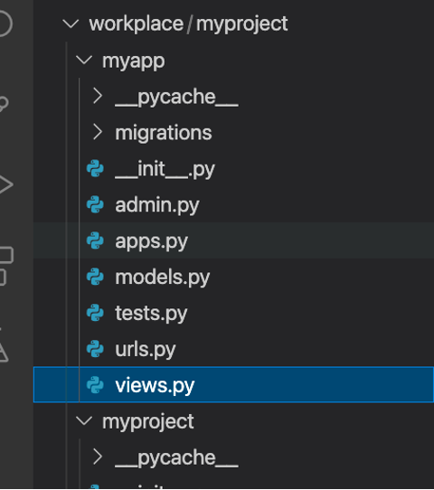
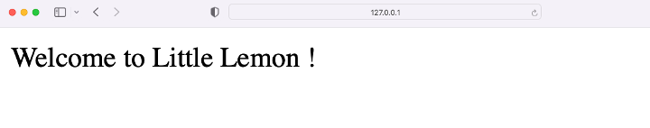
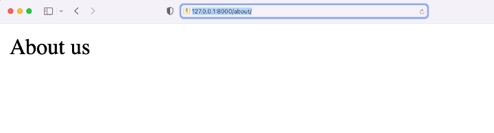
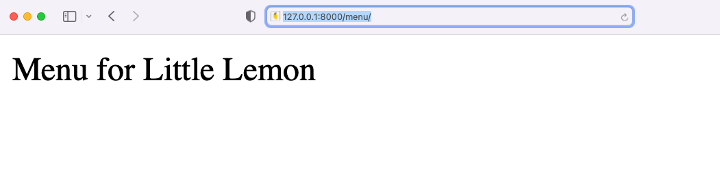
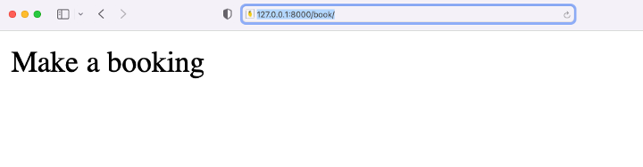

## Creating URLs and Mapping to Views


### Goal

- To create more than one view, add their respective URL configurations and display contents on a webpage.

### Objectives

- Add URL configurations at the app level for multiple views
- Learn how to create multiple views inside the views.py


### Introduction

In this lab you will learn how to create multiple views and map their respective URLs for the Little Lemon website containing four pages.

You will create four view functions to represent the pages Home, About, Menu and Booking. You will define four unique URLs and map each to its associated view function in the urls.py file of the app.

### Scenario

You are assigned the task of creating four views for the Little Lemon website that Adrian, owner of Little Lemon, wants to create.

These views will be visible on four different URL paths in the browser.

To preview the web pages, you will need to start the development server and navigate to the suggested URL to confirm the expected view is visible in the browser.

This lab will require you to modify the following files:

- views.py
- urls.py(app-level)

Additionally, you are required to use the command line console inside the terminal of VS Code.

If not open already, go to 'Terminal' on the Menu bar at the top of your screen and select 'New Terminal'.


You have already built the project named ```myproject``` and added an app inside the project called ```myapp```.

Follow the instructions below and ensure you check the output at every step and update the necessary files to create different views.

# Steps

**Step 1:**
 The project and app are already in place. The ```settings.py``` and project-level ```urls.py``` file has configurations updated for the project.

Ensure the current working directory is 'workplace' and run the change directory command inside the command prompt to go inside the project directory by typing:

```cd myproject```


**Tip:** you can check this was successful if the console prompt has a suffix 'myproject'.

**Step 2:**
 Inside the left explorer panel in VS Code, expand the 'myapp' directory and open the file called ```views.py```.



**Note:** One can also expand the 'myproject' directory and have an overview of the files present inside the project.

**Step 3:**
 Inside the ```views.py``` file, define a function called ```home()``` and pass ```request``` object to it.

**Tip:** Make sure you have imported ```HttpResponse```.

**Step 4:**
 Inside the function body, use the return statement to return an ```HttpResponse()``` and pass the following string to it:

```Welcome to Little Lemon!```


**Step 5:**
 Similar to steps 3 and 4, create three more views with the function names and strings as follows:

| **Function name** | **String output** |
| --- | --- |
| about | About us |
| menu | Menu |
| book | Make a booking |

**Step 6:**
 Create a file inside the ```myapp``` directory called ```urls.py```. Add the following code inside it:

```
urlpatterns = [     
        path('', views.home, name="home"),    
]

```

The ```urlpatterns``` now has one path function that has an empty string and relative path for the ```home()``` view function inside the views.py file.

**Step 7:**
 Now, add three more path functions inside the ```urlpatterns``` list. Each function must contain a URL string and the relative path for the associated view function. The string value associated with the path passed inside the path function must be the same as names given to the view functions such as: ```'about/'```

**Tip:** Ensure you add a comma```(,)``` after every path function added inside the urlpatterns list sequence.

**Step 8:**
 Inside the ```urls.py``` file, make sure you have imported the functions: ```path()```, from the package ```django.urls```

Tip: Also make sure you have imported the required views.

**Step 9:**
 Go back to the console in the terminal and run the command to start the development server:

```python3 manage.py runserver```


**Step 10:**
 The command prompt will generate some text including a link for the localhost URL such as ```http://127.0.0.1:8000/```.

Click on the 'Browser Preview' option among the left hand menu options inside VSCode. Now copy the URL ```http://127.0.0.1:8000/``` generated above and paste it inside the Browser Window that has opened inside the VSCode.

**Step 11:**
 Inside the browser go to the paths below and ensure you get the expected output:

[http://127.0.0.1:8000/](http://127.0.0.1:8000/)



[http://127.0.0.1:8000/about/](http://127.0.0.1:8000/about/)



[http://127.0.0.1:8000/menu/](http://127.0.0.1:8000/menu/)



[http://127.0.0.1:8000/book/](http://127.0.0.1:8000/booking/)



**Additional step:**

**Note:** Setting the same string values to define the URL path and the view is a good practice, not a rule. For example, for the ```about``` view, you could set the URL path to ```'aboutus/'``` instead of ```'about'```.

Change the URL path string for the about view inside ```urls.py``` from ```'about/'``` to ```'aboutus/'``` and run the server again.

Go to the URL ```http://127.0.0.1:8000/aboutus``` and check if the About page renders at this URL.

Additionally, ensure that the about page will not render on the URL ```http://127.0.0.1:8000/about```.

## Concluding Thoughts

In this lab, you practiced creating multiple views and map their respective URLs for the Little Lemon website containing four pages.