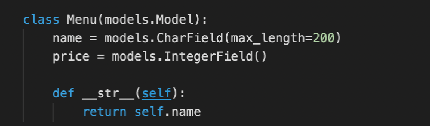
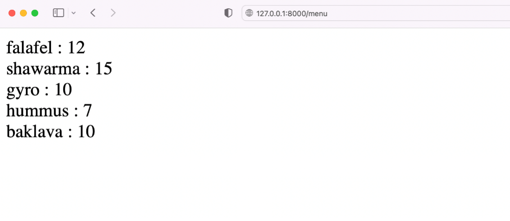

## Creating Dynamic Templates


### **Goal**

- The learner will practice using Dynamic Templates in Django

### **Objectives**

- The learner will fetch dynamic content from the model inside the view
- The learner will update view created for Menu with dynamic content
- The learner will pass the dynamic content to the template and run a loop to fetch item values.


### **Introduction**

In this lab you will use templates to create a webpage containing static HTML content. You will then load dynamic content on the Menu page from a model, and then pass this as an object to the template.

### **Scenario**

The Little Lemon website is set up to use Django templates.

Before more advanced templating is implemented, Mario has asked you to perform a test to extract some data from the database and display it on a page.

Using your existing knowledge of Models, Views, Dictionaries, and the Django Template language, your task is to display some dynamic content using a template.

### Learner Instructions

Initial Lab Instructions:

This lab will require you to modify the following files:

- views.py
- templates/menu.html

Additionally, you are required to use the command line console inside the terminal of VS Code.

If not open already, go to ```Terminal``` on the Menu bar at the top of your screen and select ```New Terminal```.


You have already built the project named ```myproject``` and added an app inside the project called ```myapp```.

**Note:**


Follow the instructions below and ensure you check the output at every step and update the necessary files to ensure the view is rendered.

# **Steps**

**Step 1:**
Open the ```models.py``` file and see the two attributes present inside the Model.




In the terminal, run the code to perform the migrations to ensure the model objects are updated.

**Step 2:**

Open the ```views.py``` file in the project directory and create a view function for ```menu```.

**Tip:** Remember to import the ```HttpResponse()``` object from ```django.http``` .

**Step 3:**

Inside the ```views.py``` file, import the Menu model from the models file present inside the same app folder.

**Step 4:**

Now in the ```views.py``` file, in the view function called ```menu```, pass ```request``` object. Inside the menu view function body, perform the following steps:

1. Create a variable called ```menu_items``` and assign it the value of the function:

```Menu.objects.all()```

2. Create a new dictionary called ```items_dict``` that will have one key-value pair. The key for this dictionary will be a string ```"menu"``` and value for it will be the variable ```menu_items```.
3. Return the ```render()``` function from the view, where you will first pass the request object, followed by the template value of ```menu.html```. And finally, the dictionary ```items_dict``` that you created earlier.

4. In the terminal, run the code to perform the migrations to ensure the model objects are updated.

**Note:** The URL configuration files are already updated for the view.
**Note:** The migrations for the models are already performed before the URLs and views are configured for the lab. You will not see not see any changes detected on running migrations.


**Note:** The URL configuration files are already updated for the view.

**Step 5:**
Open the template file ```menu.html``` already in place and you must add few lines of code to update the template as per the instructions below:

Open the template file ```menu.html``` and using the syntax for Django Template Language (DTL) create the code for the following steps:

1. Add a condition to check if the ```menu``` dictionary is present.
2. Underneath, create the code to run a ```for``` loop with the condition to iterate over all the items inside the ```menu``` dictionary.
3. Inside the body of the ```for``` loop, use DTL to display the two attributes present inside the ```menu``` dictionary.

**Tip:** Use ```item.name``` and ```item.price``` inside the appropriate DTL syntax and add a colon ```:``` in between the two values as a separator.
4. Add an HTML tag for line break using the ```<br>``` tag.
5. Create the code to end the ```for``` loop.
6. Underneath, create the code to specify the else condition using the appropriate DTL syntax.
7. Inside the else condition, add the string: ```'No items to display'```.
8. Create the code to end the if condition.

**Note:** The settings for templates inside ```settings.py``` file are already updated.

**Step 6:**

In the terminal and run the command to start the development server. Open the browser and navigate to the following URL:

```http://127.0.0.1:8000/menu ```



Make sure the values present inside the model are displayed correctly.

Additional Step: Create a superuser and add an entry inside the database table for ```Menu``` model to see if the entries can be updated.

## **Concluding Thoughts**

In this lab, you practiced creating a template and updating it with dynamic content retrieved from the model.