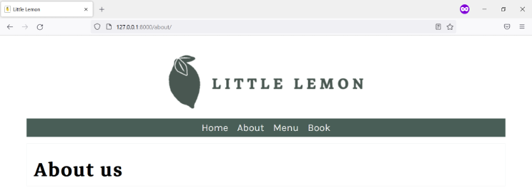
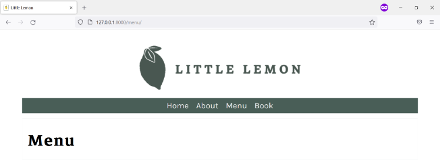
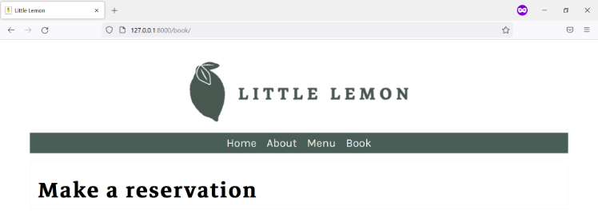
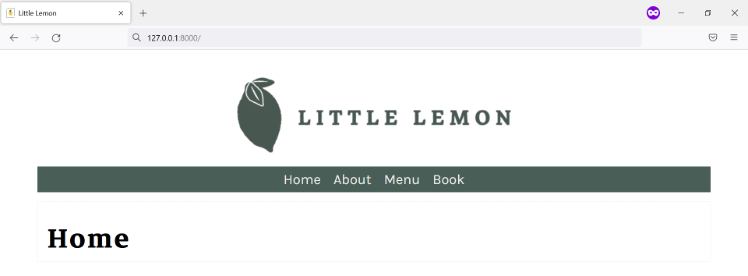

## **Lab Assets**

The learner is provided with a basic setup for Django environment for the project and app inside a virtual environment.

### **Goal**

- The learner will practice using partial Templates in Django

### **Objectives**

- The learner will use partial templates using keywords include and extends


### **Introduction**

In this lab you will be using the template inheritance property of Django to extend the functionality of a given template. The lab consists of commonly used example of header information within a partial template.

### **Scenario**

The pages on little lemon have the required webpages designed in order but have a missing element of Menu bar used to navigate. Mario who is overlooking the details realizes that the use of the Django framework in addition to the static HTML may be a better approach at this point and needs learners help to achieve that.

Your task is to use your existing knowledge of template inheritance to build header information such as a Menu bar and some other footer information that will be common across all the webpages.

###

### **Learner Instructions**

Initial Lab Instructions:

This lab will require you to modify the following files:

- templates/base.html
- templates/book.html
- templates/menu.html
- templates/index.html
- templates/about.html
- templates/partials/\_header.html
- views.py
- settings.py

Additionally, you are required to use the command line console inside the terminal of VS Code.

If not open already, go to 'Terminal' on the Menu bar at the top of your screen and select 'New Terminal'.

**Note:**

You have already built the project named ```myproject``` and added an app inside the project called 'myapp'.

Follow the instructions below and ensure you check the output at every step and update the necessary files to create different views.

## **Steps**

**Step 1:**

Expand the 'myproject' folder on the left-hand side menu and open the settings.py file and set the value of ```STATICFILES_DIRS``` option to ```'myproject/static'``` inside a list.

**Tip:** Make sure you add a comma (```,```) after the string.

**Step 2:**

Open the ```views.py``` file and create four view functions:

Home, Menu, About and Book with the same respective view names.

Add the return statement with the ```render()``` function and pass the following arguments:

``` render(request, 'page.html') ```

**Tip:** In the code above, replace ```page.html``` with the name of the html page you want to render.

**Tip:** Make sure to import the render function for use

```from django.shortcuts import render ```

**Step 4:**
Open the folder called ```templates``` at the root project-level directory. Create a folder called ```partials``` inside the ```templates``` folder.

**Step 5:**
Inside the partials folder, create a file called ```_header.html```.

**Step 6:**
Add the contents of the HTML code provided below to the ```_header.html``` file:

```
 <!-- Add code to load static content-->

<header>
  
</header>
<nav>
  <ul>
    <li><a href="">Home</a></li>
    <li><a href="">About</a></li>
    <li><a href="">Menu</a></li>
    <li><a href="">Book</a></li>
  </ul>
</nav>

```

**Step 7:**

Inside the code you just pasted, locate the line with the comment ```<!-- Add code to load static content--\>```. Below this line add the following code:

``` load static ```

Complete this code by placing the surrounding Django template language syntax for tags.

**Step 8:**

Next open the file about.html and locate the line with the comment ```<!-- Add code to extend base.html file -->```.

Underneath this line, add with the code that will extend the base.html file using the extends keyword surrounded by the Django template language syntax for tags.

**Step 9:**

Next open the file index.html and fill in the code below, locate the lines with the comments.

The three comments are as follows:

1. ```<!-- Add code to extend base.html file -->```.

Add code that will extend the base.html here below this line with the extends keyword and surrounding by the template language syntax for tags.

**Tip:** Make use of the extend keyword followed by the file name in string format.

2. ```<!-- Add code to load static content -->```

Add the same code that you have used to load static content as in Step 7

3. 
```
<!-- Begin block content -->
 <p> About Us</p>
 <p> This is an About page for Little Lemon </p>
 <!-- End block content -->
```
Replace the two lines commented with the respective code for beginning and ending a block.
**Tip:** Make sure you have syntax for template language tags in place surrounding this code.

**Step 10:**
Repeat step 9 for the remaining three HTML pages: Menu, About and Book. Make sure you also replace the keywords present inside the paragraph tags and replace it with the page name such as 'Menu' or 'Booking'

**Step 11:**
Inside the templates folder, open the ```base.html``` file and locate the comment:

```<!-- Add include tag -->```
 
In the line underneath, use the include tag before the relative path of the file _header.html. Make sure you add the relevant surrounding tags for the Django template language.

**Tip:** This can be done with the help of include keyword followed by the file name to be included ```_header.html```. Remember that the file ```_header.html``` is present in the ```partials``` directory, so make sure you add the correct relative path for _header.html file and inside a string. 

**Step 12:**
 Locate the HTML tag ```<main>``` and the comment 
```
<main>
      <!-- Begin block content -->

      <!-- End block content -->
</main>
```

In the line underneath, add the tags to begin and end the block content.

**Step 13:**
In the terminal run the command to run the server and launch the browser at the localhost URL.


**Step 14:**

In the browser, navigate to the following URLs:

```https:127.0.0.1:8000/about```



```https:127.0.0.1:8000/menu```



```https:127.0.0.1:8000/book```



```https:127.0.0.1:8000/```



## **Concluding Thoughts**

In this lab, you practiced adding a HTML menu to your webpages using Template Inheritance.